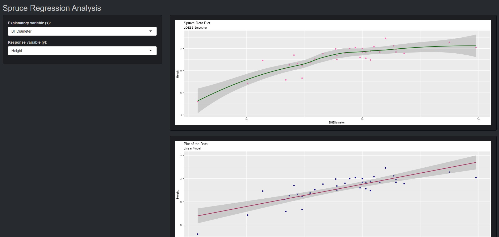

```{r, include = FALSE}
knitr::opts_chunk$set(
  collapse = TRUE,
  comment = "#>"
)
```

```{r setup}
library(math4753ROSAlab13)
```

# Introduction

This package contains a Shiny App which displays regression analyses based on the Spruce data set. The first graph plots the $Height$ by $BHDiameter$ and contains a LOESS smoother curve. The second plot fits a linear model while the third, a quadratic is fitted. There is a bonus fourth plot in this app which displays the residual diagnostic graph also with a LOESS curve.

# The App - "Shiny Lines"

To view this app, run the following code in an active `R` session: 

`shiny::runGitHub(repo = "MATH4753ROSAlab13", username = "brandanrosa", subdir = "inst/shinylines")`

Below are some screenshots of the app.

{width=700px}

{width=700px}


